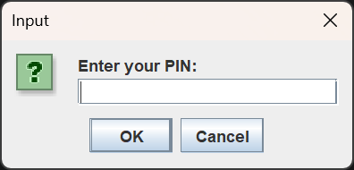
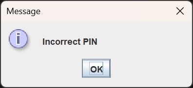
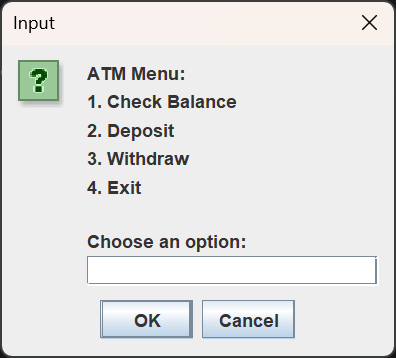
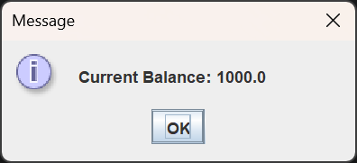
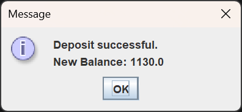
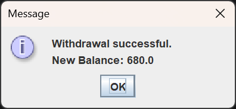
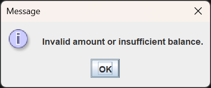

# ATM Simulation System (Java)

## Versions

### Version 1 (V1)
Basic CLI implementation using fundamental programming concepts.

### Version 2 (V2)
Object-Oriented implementation using:
- Classes and Objects
- Encapsulation
- Constructors
- Methods for system operations

### Version 2.5 (V2.5)
GUI implementation using:
- JOptionPane for user interaction
- Improved user experience compared to CLI

### Future (Version 3)
- Python implementation
- File handling (persistent data)
- Enhanced system design

## Overview
This project is a simple ATM simulation system developed using Java.  
It demonstrates fundamental programming concepts by simulating basic banking operations through a Command Line Interface (CLI).

This project represents Version 1 (V1) of a progressive development series, where the system will be enhanced using more advanced programming concepts in future versions.

---

## Features
- PIN authentication with limited attempts
- Check balance
- Deposit money
- Withdraw money
- Basic input validation
- Menu-driven interaction

---

## Concepts Used
This project is based on fundamental programming concepts:

- Variables and data types
- Conditional statements (if / else)
- Loops (while, do-while)
- User input using Scanner
- Basic program structure

---

## Technologies
- Java
- Command Line Interface (CLI)

---

## Future Improvements

Version 2:
- Object-Oriented Programming (OOP)
- Classes and methods
- Improved structure and modularity

Version 3:
- Python implementation
- Graphical User Interface (GUI)
- File handling (persistent data)
- Basic security enhancements

---

## Screenshots

### Version 1 (CLI)

### Check Balance

### Deposit Operation

### Withdraw Operation

### Exit

---

### Version 2.5 (GUI using JOptionPane)

### PIN Authentication

### Incorrect PIN

### Main Menu

### Check Balance

### Deposit Operation

### Withdraw Operation

### Error Handling (Invalid / Insufficient Balance)

## Author
Cybersecurity student building a strong technical foundation and professional portfolio.

---

## Note
This project is part of a personal learning journey and will be continuously improved.
